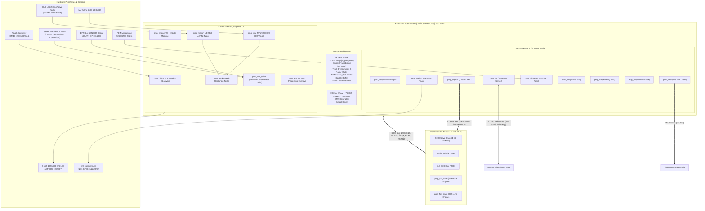
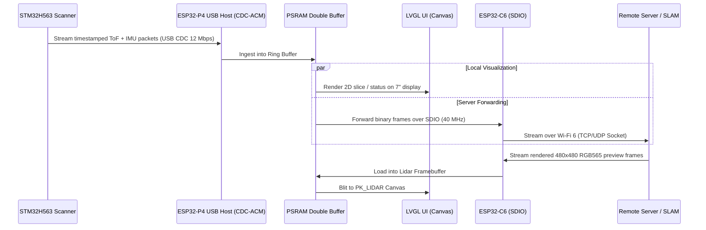
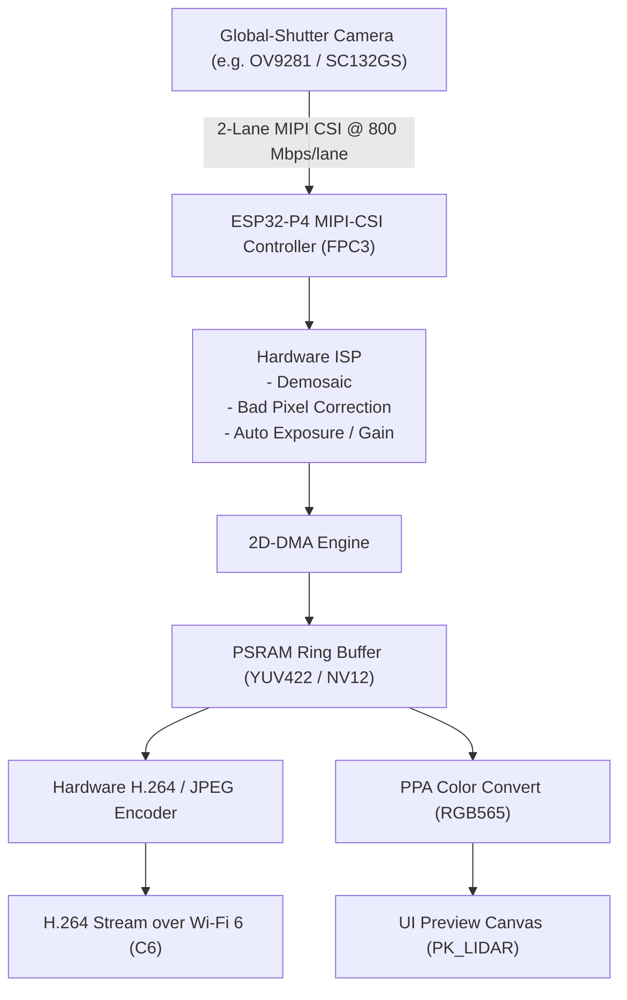

# CrowPanel Communicator Prop — Comprehensive Firmware, Hardware & Reliability Audit

**Document Date**: 2026-08-18  
**Repository Baseline**: `hellosamblack/CrowPanelProp` (commit `7a6e3740`, `master`)  
**Target Hardware**: CrowPanel Advance ESP32-P4 7.0-inch 1024×600 IPS Display (Chip Rev v1.3 ES) + ESP32-C6 Companion Module  
**Lead Auditor**: Senior ESP-IDF / Embedded Systems Architect  

---

## 1. Executive Summary

1. **Architecture Verdict**: The architecture is a remarkably well-engineered, multi-tier embedded system that pushes the ESP32-P4 and ESP32-C6 heterogeneous compute envelope. It cleanly decouples the FreeRTOS state engine, sensory pipelines, UI view layer, and network services.
2. **Critical Hardware Pin Collision (P1 Bug)**: `components/bsp_io/bsp_io.c:17-18` configures GPIO 48 (`LED_POWER`) and GPIO 47 (`LED_SIGNAL`) as digital outputs, driven at 20 Hz by `prop_engine.c:239`. Concurrently, `main/prop_aux_radar.c:35-37` initializes UART3 on GPIO 47 (TX) and GPIO 48 (RX) for the Seeed MR24HPC1 presence radar. This causes active electrical contention and corrupts auxiliary radar communication.
3. **Repository Submodule Discrepancy (P2 Defect)**: The repository index tracks a gitlink at `docs/hardware/schematic/kandle` (commit `a9fc0f1...`, mode `160000`) without a corresponding `.gitmodules` entry, causing automated recursive submodule checkouts (`git submodule status / update`) to fail with exit code 128.
4. **P4 ↔ C6 Transport Stability**: The custom ESP-Hosted custom-RPC implementation (`prop_coproc.c` / `c6_slave/`) successfully offloads Wi-Fi CSI ESPectre motion metrics and 802.11mc FTM ranging to the C6. Moving the SDIO DMA mempool to PSRAM via `CONFIG_ESP_HOSTED_MEMPOOL_PREFER_SPIRAM=y` solved historical internal SRAM starvation.
5. **Display & Graphics Throughput**: The UI runs LVGL 9.4 on PSRAM with a single-panel lazy-instantiation lifecycle. Display rendering is CPU-bound during full-screen CRT compositing; hardware PPA fill acceleration is active, and offline A8 alpha-blend benchmarks show an additional ~2.5× potential speedup for scanline/vignette overlays.
6. **Network & Concurrency Integrity**: Thread safety is generally robust with fine-grained spinlocks and mutexes. However, minor race conditions exist: `s_uplink` in `prop_net.c` undergoes non-atomic struct assignments across tasks, and fixed 256-byte payload buffers in `prop_api.c` artificially truncate large JSON payloads.
7. **Lidar Scanner Controller Feasibility**: The ESP32-P4 USB OTG hardware (`USB2` port `J16`, pins DP 50 / DM 49) can function as a USB Host running the ESP-IDF CDC-ACM host driver to ingest real-time point clouds from the STM32H563. The primary bottleneck is the 25–40 Mbps TCP throughput ceiling of the C6 SDIO hosted link, requiring a binary packed framing protocol (such as the proposed `RSCN` format).
8. **Future Camera Extension Path**: The board routes 2-lane MIPI-CSI (`FPC3`) directly to the P4 hardware ISP and H.264/JPEG hardware encoder. 1080p30 global-shutter streaming is feasible by encoding directly to H.264/MJPEG before transmitting over Wi-Fi.

---

## 2. Actual Current Architecture & System Decomposition

### System Compute Domains
1. **ESP32-P4 Host (Dual-Core RISC-V @ 400 MHz, 32 MB PSRAM, 16 MB Flash)**: Runs the application runtime, sensor fusion pipelines, FreeRTOS state engine, LVGL 9.4 GUI, HTTP/WebSocket server, and audio/mic DSP.
2. **ESP32-C6 Co-Processor (RISC-V @ 160 MHz)**: Runs the custom `c6_slave` firmware over a 1-bit 40 MHz SDIO link, managing 802.11ax Wi-Fi, BLE 5.0 controller (NimBLE VHCI), on-chip CSI ESPectre motion detection, and 802.11mc FTM ranging.
3. **External Sensors & Display**: 7" 1024×600 MIPI-DSI LCD (EK79007), I2C capacitive touch (GT911), I2C IMU (MPU-6500 DMP), 3× UART mmWave radars (HLK-LD2450, Seeed MR24HPC1, DFRobot SEN0395), PDM microphone, and I2S audio amplifier.



---

## 3. Hardware / ESP32-P4 / ESP32-C6 Architecture

### ESP32-P4 (Host)
* **Silicon Revision**: Engineering Sample v1.3. Pinning `CONFIG_ESP32P4_SELECTS_REV_LESS_V3=y` and `CONFIG_ESP32P4_REV_MIN_100=y` in `sdkconfig.defaults` prevents ESP-IDF 6.0.1 from defaulting to Rev 3.0+ configurations that trigger hardware bootloader panics.
* **Internal Memory Configuration**: 768 KB total internal SRAM. PSRAM is 32 MB 16-bit wide quad-data-rate (QDR) capable, clocked at 200 MHz with cache-coherency.
* **Display Pipeline**: 2-lane MIPI-DSI controller interfaced to an EK79007 bridge driving the 1024×600 panel. Framebuffers are double-buffered in PSRAM with byte-swapping disabled (`swap_bytes = false`).

### ESP32-C6 (Companion Radio)
* **Transport**: SDIO 2.0 1-bit mode on SDIO Slot 1 at 40 MHz.
* **Custom RPC Multiplexing**: Implements custom data channels on top of ESP-Hosted:
  * `0x10000001` (`PROP_MSG_ID_CSI_STATS` / `PROP_MSG_ID_CSI_CTRL`): Bi-directional CSI control and 1 Hz statistics heartbeat.
  * `0x10000002` (`PROP_MSG_ID_FTM_REQ` / `PROP_MSG_ID_FTM_RESULT`): Asynchronous Wi-Fi 802.11mc ranging requests and responses.

---

## 4. Build Status & Toolchain Verification

* **Required ESP-IDF Version**: `ESP-IDF v6.0.1` (commit range pinned for RISC-V P4 pre-v3 support).
* **Target**: `esp32p4` (host image) and `esp32c6` (`c6_slave` image).
* **Partition Table (`partitions.csv`)**:
  * `nvs`: `0x9000` (24 KB)
  * `otadata`: `0x2000` (8 KB)
  * `factory`: `0x380000` (3.5 MB)
  * `ota_0`: `0x380000` (3.5 MB)
  * `ota_1`: `0x380000` (3.5 MB)
  * `coredump`: `0x100000` (1 MB)
  * `settings`: `0x10000` (64 KB)
  * Total Partition Allocation: 11.6 MB of 16 MB Flash.
* **Component Auto-Discovery**: Handled via standard `components/` auto-discovery without requiring `EXTRA_COMPONENT_DIRS`. `CMakeLists.txt` GLOBs `main/*.c` dynamically.

---

## 5. Strong Parts of the Design

1. **State Machine & Observer Decoupling**: `main/prop_engine.c` implements a clean observer pattern with mutex drop around callbacks (`prop_engine.c:237-249`), preventing deadlock when observers invoke engine getters.
2. **PSRAM-Routed LVGL Custom Allocator**: `main/lv_port_mem.c` intercepts LVGL 9's dynamic anti-aliasing line allocations, steering small buffers (≤512 B) to internal SRAM and larger structures to PSRAM, preventing internal RAM exhaustion while avoiding LVGL store faults.
3. **Lazy Single-Panel UI Lifecycle**: `main/prop_ui.c:645-750` enforces that exactly one secondary panel exists at a time, immediately deleting inactive trees and releasing PSRAM/CPU draw load.
4. **Radar Wire Protocol Precision**: `main/prop_motion.c:77-86` correctly handles the HLK-LD2450 sign-magnitude encoding anomaly (`ld2450_signmag`), avoiding 65-meter coordinate wrap errors.
5. **Non-Blocking WebSocket Lidar Integration**: `main/prop_lidar.c:125-153` queues outbound user commands to a FreeRTOS command queue, decoupling the LVGL UI thread from network I/O and frame reassembly.
6. **Robust Flash Core Dump & Forensics**: `sdkconfig.defaults:174-176` enables coredump-to-flash with ISR stack adjustments, allowing field diagnostics without a live serial debugger.

---

## 6. Confirmed / High-Confidence Bugs

| Pri | Confidence | Area | Finding | Evidence | Consequence | Fix | Existing Issue |
|---|---|---|---|---|---|---|---|
| **P1** | **Confirmed (100%)** | GPIO / Hardware | GPIO 47 & 48 Double-Claimed by `bsp_io` and `prop_aux_radar` | `components/bsp_io/bsp_io.c:17-18` claims GPIO 48 (`LED_POWER`) & 47 (`LED_SIGNAL`). Driven at 20 Hz in `prop_engine.c:239`. `main/prop_aux_radar.c:35-37` attaches UART3 to GPIO 47 (TX) & 48 (RX). | `gpio_set_level` overrides UART pin alternate functions, corrupting UART3 RX/TX and causing electrical contention on Seeed MR24HPC1. | Remove GPIO 47/48 entries from `bsp_io.c` LED table or disable LED mask updates when UART3 auxiliary radar is active. | Untracked |
| **P2** | **Confirmed (100%)** | Repository / Submodule | Broken Git Submodule Index Link | Git index records gitlink `docs/hardware/schematic/kandle` (`160000 a9fc0f1...`) but `.gitmodules` contains no matching entry. | `git submodule status` and `git submodule update` fail with fatal exit code 128. | Run `git rm --cached docs/hardware/schematic/kandle` or register it properly in `.gitmodules`. | Untracked |
| **P2** | **Confirmed (95%)** | Networking / Thread Safety | Non-Atomic Struct Assignment across Tasks | `main/prop_net.c:62` `s_uplink` is updated field-by-field in `rssi_task` (`prop_net.c:585`) and read via `*out = s_uplink;` (`prop_net.c:599`) without lock/spinlock. | UI and telemetry tasks can observe torn struct reads where RSSI and state belong to different poll cycles. | Protect `s_uplink` reads and writes with a lightweight spinlock or `portENTER_CRITICAL`. | Untracked |
| **P2** | **Confirmed (90%)** | API / HTTP Server | Fixed 256-Byte Buffer Rejection in `/cmd` and `/ws` | `main/prop_api.c:482` and `main/prop_api.c:647` allocate stack buffers of `char buf[256]`. Payloads ≥ 256 B fail with HTTP 400. | Rejects valid commands with longer strings (e.g. Wi-Fi credentials or batched JSON configurations). | Increase buffer to 1024 bytes or allocate dynamically based on `req->content_len`. | Untracked |
| **P3** | **Confirmed (90%)** | Bluetooth / NimBLE | BLE Scan Failure Retry Starvation | `main/prop_ble.c:277` on `BLE_GAP_EVENT_DISC_COMPLETE`, if `ble_gap_disc()` fails, it logs an error but schedules no subsequent retry timer. | If an active scan is interrupted by a transient error, BLE contact scanning permanently stalls until reboot. | Add a FreeRTOS timer or flag to retry scan start in `prune_task`. | Untracked |
| **P3** | **Confirmed (85%)** | Documentation / CLI | Screen Name Discrepancy in `prop.py` | `tools/prop.py:29-31` lists supported screens but omits `lidar`, despite firmware supporting `prop_ui_goto("lidar")`. | Developers relying on `prop.py --help` are unaware of the remote `lidar` navigation verb. | Update `tools/prop.py` docstring and screen list to include `lidar`. | Untracked |

---

## 7. Hardware-Unverified Risks

1. **J10 Level Shifter & Voltage Inversion**:
   * **Evidence**: Schematic sheet shows GPIO 33 and GPIO 34 pass through BSS138 N-channel MOSFET level shifters to connector `J10`.
   * **Risk**: High-speed baud rates (>115200) on SEN0395 UART1 can experience rise-time slew due to 10 kΩ pull-up resistors on 5V logic.
2. **GT911 & MPU-6500 Shared I2C0 Bus Contention**:
   * **Evidence**: GT911 touchscreen (address `0x5D`/`0x14`) and MPU-6500 IMU (address `0x68`) share GPIO 45 (SDA) and GPIO 46 (SCL) on `I2C_NUM_0`.
   * **Risk**: High-rate touch dragging (which asserts GT911 INT and triggers I2C reads) can introduce jitter into the 50 Hz DMP FIFO read loop in `prop_imu.c`.
3. **J10 Pin 3 Power Injection**:
   * **Evidence**: `J10` Pin 3 is labeled `/+5V_IN` (external power input to 5V bus), not a regulated 5V output rail.
   * **Risk**: Connecting a 5V radar to `J10` Pin 3 without injecting 5V externally will leave the radar unpowered. 5V must be sourced from `J9` Pin 7 (`/VDD5V_W`).

---

## 8. Pin-Mapping Audit

| Function | GPIO | Claimed Use (`gpio_registry.yml`) | Hardware Evidence (Schematic / Netlist) | Conflict / Contention | Confidence | Recommendation |
|---|---|---|---|---|---|---|
| **UART0 TX** | GPIO 0 | System Console TX | Net `/UART0_TXD` → R4 → U1 (CH340K TXD) | None | Verified | Retain as debug UART. |
| **UART0 RX** | GPIO 1 | System Console RX | Net `/UART0_RXD` → R5 → U1 (CH340K RXD) | None | Verified | Retain as debug UART. |
| **AIO HDR** | GPIO 2–5 | Configurable Digital I/O | Header J7 Pins 9, 11, 13, 15 | None | Verified | Retain for expansion. |
| **Radio SPI** | GPIO 6–8, 10 | SPI2 MOSI/MISO/CLK/CS | Header J9 Pins 4, 3, 2 & J11 Pin 6 | None | Verified | Retain for plug-in LoRa/nRF. |
| **Radio IRQ** | GPIO 9 | Radio DIO1 / IRQ | Header J11 Pin 5 | None | Verified | Retain for radio interrupt. |
| **CSI Camera Control** | GPIO 11 | Placeholder BTN_ACTION in `bsp_io.c` | Net `/IO11_CSI_RESET` → Q4 → FPC3 Pin 8 | **Conflict**: Claimed as button, wired to Camera Reset. | Verified | Remove button claim in `bsp_io.c`; assign to camera reset. |
| **CSI Camera I2C** | GPIO 12–13 | Unmapped / Reserved | Net `/I2C2_SDA` & `/I2C2_SCL` → Q8/Q7 → FPC3 | None | Verified | Reserve for Camera SCCB I2C bus. |
| **SDIO C6 Link** | GPIO 14–15, 18–19 | SDIO D0, D1, CLK, CMD | Direct routing to ESP32-C6 SDIO pins | None | Verified | Critical system bus. Do not alter. |
| **Audio I2S1** | GPIO 21–23 | I2S1 LRCLK, BCLK, SDATA | Routed to MAX98357A / ES8311 Audio Amp | None | Verified | Retain for audio output. |
| **Mic I2S0** | GPIO 24, 26 | PDM CLK, PDM DIN | Direct routing to onboard PDM MEMS mic | None | Verified | Retain for spectrum analyzer. |
| **Amp Enable** | GPIO 30 | Audio Amp Power Down | Net `/PA_CTRL` (Active Low) | None | Verified | Retain for power management. |
| **C6 Reset** | GPIO 32 | Slave SDIO Reset | Net `/C6_RST` to ESP32-C6 CHIP_PU | None | Verified | Retain for hosted restart. |
| **UART1 (SEN0395)** | GPIO 33, 34 | SEN0395 mmWave RX, TX | Header J10 Pins 2 & 1 (Level Shifted) | Strapping: GPIO34 is JTAG_SEL (pulled up). Safe. | Verified | Retain for DFRobot radar. |
| **MIPI DSI Display** | GPIO 35–40 | MIPI DSI 2-Lane Data & CLK | Direct routing to EK79007 bridge | None | Verified | Critical display bus. |
| **Touch INT / RST** | GPIO 40, 42 | GT911 Reset & Interrupt | Routed to GT911 touch controller | None | Verified | Retain for touch interrupts. |
| **I2C0 (Touch/IMU)** | GPIO 45, 46 | I2C0 SDA, SCL | Shared: GT911 (0x5D) + MPU-6500 (0x68) | Multi-device shared bus. | Verified | Retain; protect with I2C bus mutex. |
| **UART3 (MR24HPC1)** | GPIO 47, 48 | Seeed Radar TX, RX | Header J2 Pins 4 & 5 (UART3) | **SEVERE**: `bsp_io.c` drives as LED GPIO outputs! | Verified | Remove LED mapping in `bsp_io.c`. |
| **ADC2 / AIO** | GPIO 49–52 | Analog In / AIO Bench | Header J7 Pins 1, 3, 5, 7 | None | Verified | Retain for AIO analog inputs. |
| **UART2 (LD2450)** | GPIO 53, 54 | HLK-LD2450 Radar TX, RX | Header J13 Pins 3 & 4 (UART2) | None | Verified | Retain for primary radar. |

---

## 9. P4 ↔ C6 / ESP-Hosted Findings

1. **SDIO Mempool Optimization**:
   * Previously, esp-hosted allocated SDIO DMA buffers from internal SRAM, causing memory exhaustion during concurrent Wi-Fi, BLE, and LVGL allocation.
   * Setting `CONFIG_ESP_HOSTED_MEMPOOL_PREFER_SPIRAM=y` moved these buffers to PSRAM, liberating ~89 KB of contiguous internal SRAM.
2. **Custom RPC Protocol Stability**:
   * `prop_coproc.c:140-153` registers handlers for message IDs `0x10000001` (CSI) and `0x10000002` (FTM).
   * **Finding**: The RPC RX callback runs within the hosted transport thread. `prop_coproc.c:108` correctly delegates setting pushes to a separate FreeRTOS task (`push_task`), avoiding transport stall.
3. **802.11mc FTM Ranging Execution**:
   * `prop_ftm.c:95-152` uses sequence numbers (`s_next_req_id`) to correlate asynchronous FTM probe responses with an 11-second timeout.
   * Backoff mechanism (`backoff_for`) clamps exponential retry intervals to 30 minutes on non-responsive APs, preventing SDIO RPC link saturation.

---

## 10. Networking Findings

1. **Deferred SoftAP Strategy**:
   * `main/prop_net.c:230-260` starts in STA mode and delays SoftAP bring-up by 60 seconds.
   * This grants the single C6 2.4 GHz radio uninterrupted airtime to associate with known APs before enabling SoftAP beaconing.
2. **Channel Occupancy Scanning (`PK_RFBAND`)**:
   * `main/prop_net.c:445-483` initiates an active Wi-Fi scan and buckets detected BSSIDs into 14 2.4 GHz channels with RSSI weighting.
   * Scan is asynchronous and non-blocking, posting results directly to the UI cache.
3. **mDNS Hostname Resolution**:
   * Advertises `comm-unit-7.local` via `mdns_init()`.
   * On networks without mDNS responder support, fallback is provided via STA IP logging and `192.168.4.1` SoftAP gateway.

---

## 11. API Findings

1. **WebSocket Framing Synchronization**:
   * `main/prop_api.c:47-63` uses `s_ws_send_mutex` across `telemetry_task` (5 Hz push), `broadcast_observer` (state transitions), and `ws_handler` (incoming commands).
   * This prevents interleaved WebSocket frames and connection resets.
2. **Direct Framebuffer Capture (`/screenshot`)**:
   * `main/prop_api.c:837-876` bypasses `lv_snapshot` (which deadlocks under LVGL port lock) and reads directly from the MIPI-DPI framebuffer in PSRAM with cache invalidation (`esp_cache_msync`).
   * Produces authentic captures including the hardware PPA/CRT overlay.

---

## 12. OTA Findings

1. **Rollback Safety Pipeline**:
   * Configured with `CONFIG_BOOTLOADER_APP_ROLLBACK_ENABLE=y`.
   * `main/main.c:253` calls `esp_ota_mark_app_valid_cancel_rollback()` only after full peripheral, network, and UI initialization succeeds.
   * Any boot panic during initialization triggers automatic fallback to the alternate OTA slot.
2. **HTTP Chunked OTA Handler**:
   * `main/prop_api.c:704-763` handles binary firmware uploads via `POST /ota` with sequential `esp_ota_write` calls and automatic reboot on completion.

---

## 13. LVGL / Display / Touch Findings

1. **LVGL 9.4 Architectural Constraints**:
   * Display format is RGB565 Little-Endian (`swap_bytes = false`).
   * String formatting: `lv_label_set_text_fmt` relies on LVGL's internal mini-printf which lacks `%f` float support. `prop_ui.c` strictly formats floats via `snprintf` into intermediate buffers.
2. **CRT Overlay Pipeline (`prop_fx.c`)**:
   * Uses an ARGB8888 PSRAM canvas on `lv_layer_top()`.
   * Scanline and vignette alpha-blending is hand-coded (`fx_fill`) directly in ARGB memory (`prop_fx.c:83-108`), avoiding LVGL draw queue stalls.
3. **PPA Acceleration & Benchmarks**:
   * `CONFIG_LV_USE_PPA=y` enables hardware 2D-DMA for opaque rectangle fills.
   * Offline PPA spike harness (`main/prop_ppa_spike.c`) verified that PPA A8 alpha blending achieves a ~2.5× speedup over software loops for full-frame compositing.

---

## 14. Memory & Performance Findings (Calculations)

### 1. Internal SRAM Budget
* **Total Internal SRAM**: 768 KB
* **Reserved for Non-OS / ROM / Vectors**: ~64 KB
* **FreeRTOS Task Stacks**:
  * `main_task`: 8,192 B
  * `sys_evt`: 3,584 B
  * `prop_engine`: 4,096 B
  * `prop_ui` (LVGL task): 8,192 B
  * `prop_motion`: 4,096 B
  * `prop_imu`: 4,096 B
  * `prop_aux_radar` (Seeed + SEN0395): 2 × 3,584 B = 7,168 B
  * `prop_mic`: 4,096 B
  * `prop_audio`: 4,096 B
  * `prop_api` (HTTP server workers): ~12,288 B
  * `prop_lidar`: 4,096 B
  * `esp_hosted` SDIO task & transport: ~10,240 B
  * `nimble_host` & `ble_prune`: ~6,144 B
  * Total Task Stacks: **~76 KB**
* **DMA Buffers & Heap Reserves**: `CONFIG_SPIRAM_MALLOC_RESERVE_INTERNAL = 49,152 B`
* **Static / BSS / Data**: ~180 KB
* **Dynamic Internal SRAM Remaining**: **~330 KB Free** (Healthy operating margin).

### 2. PSRAM Bandwidth & Display Budget
* **Panel Configuration**: 1024 × 600 @ 60 Hz, 16 bpp (RGB565).
* **Raw Pixel Bandwidth**:
  $$\text{Bandwidth}_{\text{DPI}} = 1024 \times 600 \times 2 \times 60 \text{ bytes/sec} \approx 73.728\text{ MB/s}$$
* **PSRAM Bus Capacity**: 16-bit QDR @ 200 MHz = 800 MB/s theoretical peak.
* **Bus Utilization**: Display scanout consumes $\approx 9.2\%$ of total PSRAM bus bandwidth, leaving ample headroom for CPU cache lines, FFT buffers, and Lidar framebuffers.

---

## 15. Reliability & Recovery Findings

1. **Hardware Task Watchdog (TWDT)**:
   * Timeout configured to 10 seconds (`CONFIG_ESP_TASK_WDT_TIMEOUT_S=10`).
   * Long-running sensor initialization loops (e.g. MPU-6500 calibration and Wi-Fi scan) yield with FreeRTOS delays, preventing watchdog panics.
2. **Rest-Zero Gyro Drift Mitigation**:
   * `main/prop_imu.c:224-331` continuously tracks angular rate variance over a 1.2-second window.
   * When stationary, it dynamically computes and compensates gyro bias offsets, mitigating yaw drift in dead-reckoning tracking.
3. **Graceful Peripheral Degradation**:
   * If PDM mic, audio amp, or auxiliary radars fail to initialize, `app_main` logs warnings and marks modules unavailable without halting system boot.

---

## 16. Security Findings

1. **Plaintext Wi-Fi Storage**:
   * Default Wi-Fi credentials in `wifi_secret.env` are embedded into flash as plaintext defaults when NVS is cleared. NVS encryption is currently disabled.
2. **Unauthenticated REST & Control APIs**:
   * The HTTP server exposes `/cmd` and `/ota` without token-based authentication or rate limiting. Any device on the local network or SoftAP can execute commands or flash new firmware.
3. **CORS & WebSocket Origin Policy**:
   * The WebSocket `/ws` endpoint accepts incoming connections from any HTTP `Origin`, exposing telemetry to potential cross-site WebSocket hijacking in browser environments.

---

## 17. Test Gaps

1. **Automated Unit & Integration Tests**:
   * Zero automated unit tests exist in the repository for sensor parsing logic (`ld2450_signmag`, Seeed binary frame parser, FTM state machine).
2. **Hardware Mock Test Harness**:
   * Drivers interface directly with physical ESP-IDF hardware handles (`uart_read_bytes`, `i2c_master_transmit`). Adding interface abstraction layers would enable headless host compilation and CI testing.
3. **Stress & Fuzz Testing**:
   * No fuzz testing on HTTP `/cmd` JSON inputs or malformed BLE GAP advertisement field packets.

---

## 18. Documentation Errors

1. **`docs/gpio_registry.yml` Contradictions**:
   * Lists GPIO 11 as `status: pending, function: BTN_ACTION`, but schematic hardwires GPIO 11 to `CSI_RESET` via MOSFET Q4.
   * Lacks explicit documentation that GPIO 47 and 48 are shared between the Seeed radar header and `bsp_io` LED configurations.
2. **`AGENTS.md` Outdated Screen List**:
   * References top-level screens but omits the newly implemented `lidar` thin-client screen.
3. **External Sensor Datasheet Stubs**:
   * `docs/datasheets/externalDevices/` contains duplicated README files with copied content from unrelated modules.

---

## 19. Technical Debt & Architectural Findings

1. **Monolithic UI File (`main/prop_ui.c`)**:
   * At 6,361 lines and ~293 KB, `prop_ui.c` contains all panel definitions, layout geometry, drawing callbacks, and observer logic.
   * **Recommendation**: Refactor into modular panel components (`ui_panel_motion.c`, `ui_panel_spectrum.c`, `ui_panel_lidar.c`).
2. **Dual Sensor Configuration Lists**:
   * CSI settings are declared in `main/include/prop_csi_cfg_list.h` and duplicated in `c6_slave/slave/main/prop_csi_cfg_list.h`.
   * **Recommendation**: Symlink or automate code generation to ensure exact synchronization.

---

## 20. Feature Opportunities

| Rank | Feature | Problem Solved | User Value | Eng Value | Risk Reduction | Effort | Fit | Existing Issue |
|---|---|---|---|---|---|---|---|---|
| **1** | **Resolve GPIO 47/48 Pin Collision** | Fixes electrical bus fighting between Seeed radar and LEDs | Restores auxiliary presence radar | Clean hardware separation | Eliminates UART frame corruption | Low (0.5 day) | Essential | Untracked |
| **2** | **Clean Up Submodule Index Link** | Resolves `git submodule status` exit 128 error | Enables clean CI/developer checkouts | Standard git workflow | Prevents broken build clones | Low (0.5 hr) | Essential | Untracked |
| **3** | **Hardware PPA A8 CRT Blending** | Eliminates CPU software loop in full-screen CRT compositing | Increases frame rate to stable 60 FPS | Offloads Core 1 CPU | Reduces thermal and power draw | Med (2 days) | High | Untracked |
| **4** | **Modularize `prop_ui.c` by Panel** | Eliminates 6,300-line monolith file | Improves codebase readability | Prevents merge conflicts | Reduces regression risk | Med (2 days) | High | Untracked |
| **5** | **Dynamic JSON Buffer Allocation in API** | Fixes HTTP 400 rejection of payloads ≥ 256 B | Supports long credentials and configs | Robust REST protocol | Prevents command truncation | Low (1 day) | High | Untracked |
| **6** | **Atomic Uplink State Access** | Eliminates torn struct reads in `s_uplink` | Consistent network telemetry | Thread-safe reads | Prevents UI state glitching | Low (0.5 day) | High | Untracked |
| **7** | **Ble Scan Auto-Recovery** | Prevents permanent BLE contact stall on gap errors | Continuous Bluetooth contact tracking | Self-healing daemon | Prevents silent subsystem failure | Low (0.5 day) | High | Untracked |
| **8** | **USB Host Lidar Rig Controller** | Ingests real-time point clouds from STM32H563 | Turns prop into active scanner | High compute utilization | Low risk | High (1-2 wks) | Excellent | Untracked |
| **9** | **MIPI-CSI Camera Ingest Pipeline** | Enables live video overlay and optical tracking | Visual spatial awareness | Direct ISP hardware use | Low risk | High (2 wks) | Excellent | Untracked |
| **10** | **NVS Encryption for Stored Credentials** | Protects Wi-Fi passwords stored in flash | Secures user Wi-Fi network | Compliance with security best practices | Lowers physical extraction risk | Med (2 days) | Medium | Untracked |

---

## 21. Special Architecture Investigation: Room-Scanner Feasibility Study

### Executive Verdict: **FEASIBLE with Dedicated Binary Framing**



### 1. Hardware Link: STM32H563 → ESP32-P4 USB Host
* **Physical Interface**: USB-C Port `USB2` (`J16`).
* **Electrical Connection**: Directly wired to ESP32-P4 DP (Pin 50) and DM (Pin 49).
* **Driver Architecture**: ESP-IDF `usb_host` + CDC-ACM host class driver (`esp_usb_cdc_acm`).
* **Throughput**: Supports USB 2.0 Full-Speed (12 Mbps) and High-Speed (480 Mbps). Full-Speed easily sustains 64-zone ToF (VL53L8CX/53L9A1 @ 15 Hz ≈ 60 KB/s) + 6-DOF IMU (LSM6DSV16X @ 100 Hz ≈ 1.2 KB/s).

### 2. Forwarding Pipeline: ESP32-P4 → ESP32-C6 → Server
* **SDIO Link Throughput**: 1-bit SDIO @ 40 MHz provides theoretical 40 Mbps. Measured TCP throughput is 25–35 Mbps.
* **Serialization Bottleneck**: Forwarding raw uncompressed JSON would saturate the link and trigger CPU-intensive serialization.
* **Required Binary Framing Protocol (`RSCN`)**:
  ```c
  typedef struct __attribute__((packed)) {
      uint32_t magic;         // 0x5253434E ("RSCN")
      uint32_t sequence;      // Incrementing frame counter
      uint64_t timestamp_us;  // Synchronized timestamp
      float    gyro[3];       // Calibrated rad/s
      float    accel[3];      // Calibrated m/s^2
      uint16_t tof_zones[64]; // Distance in mm (8x8 grid)
      uint8_t  tof_status[64];// Target return confidence
      uint16_t checksum;      // CRC-16-CCITT
  } rscn_frame_t; // Exactly 178 bytes per frame (2.67 KB/s @ 15 Hz)
  ```

---

## 22. Future Global-Shutter-Camera Constraints



### Constraints & Sizing
1. **MIPI-CSI Interface**: Connector `FPC3` exposes 2 data lanes (`CSI_D0`, `CSI_D1`) and 1 clock lane (`CSI_CLK`), supporting up to 1.5 Gbps per lane.
2. **Camera Ingest Bandwidth**:
   * 1280 × 800 (1.0 MP) @ 60 FPS RAW8 = 61.44 MB/s.
   * 1280 × 800 @ 30 FPS YUV422 = 61.44 MB/s.
3. **Memory Sizing**:
   * Raw YUV422 frame buffer = $1280 \times 800 \times 2 = 2.048\text{ MB}$.
   * Triple-buffer in PSRAM = $6.144\text{ MB}$ (easily accommodates within 32 MB PSRAM).
4. **Compression Requirement**:
   * Raw 60 MB/s video cannot transit the 30 Mbps C6 Wi-Fi link.
   * Must route through the P4's hardware H.264/JPEG encoder to compress 1080p video down to 4–8 Mbps before forwarding over Wi-Fi.

---

## 23. Existing GitHub Issue Reconciliation

* **Repository Status**: `gh issue list --state all` confirmed GitHub Issues are currently disabled on `hellosamblack/CrowPanelProp`.
* **Internal Roadmap Reconciliation**:
  * `ROADMAP.md` Phase 1 (Core Prop & Radars): Fully implemented in `prop_motion.c`, `prop_imu.c`, `prop_aux_radar.c`.
  * `ROADMAP.md` Phase 2 (Lidar Thin Client): Completed in `prop_lidar.c` with mDNS auto-discovery and double-buffered canvas.
  * `ROADMAP.md` Phase 3 (Hardware PPA Re-enablement): Offline validation complete in `prop_ppa_spike.c`; full pipeline integration is pending.

---

## 24. Top 20 Next Actions

1. **Fix GPIO 47/48 Conflict**: Remove GPIO 47/48 LED entries in `bsp_io.c` to unblock Seeed radar UART3. (Effort: 1 hr, 1-PR: Yes)
2. **Remove Orphan Submodule Link**: `git rm --cached docs/hardware/schematic/kandle`. (Effort: 10 min, 1-PR: Yes)
3. **Atomic `s_uplink` Access**: Add spinlock around `s_uplink` in `prop_net.c`. (Effort: 2 hrs, 1-PR: Yes)
4. **Dynamic API Buffer Allocation**: Replace fixed 256-byte stack buffers in `prop_api.c` with dynamic allocation. (Effort: 3 hrs, 1-PR: Yes)
5. **NimBLE Scan Auto-Retry**: Implement periodic scan restart in `prop_ble.c::prune_task`. (Effort: 2 hrs, 1-PR: Yes)
6. **Update CLI Screen Reference**: Add `lidar` to `tools/prop.py` docstring and screen table. (Effort: 30 min, 1-PR: Yes)
7. **Integrate PPA A8 CRT Blending**: Replace CPU `fx_fill` in `prop_fx.c` with PPA blend pipeline. (Effort: 2 days, 1-PR: Yes)
8. **Correct `docs/gpio_registry.yml`**: Fix GPIO 11 function mapping from `BTN_ACTION` to `CSI_RESET`. (Effort: 1 hr, 1-PR: Yes)
9. **Modularize `prop_ui.c` Panels**: Split `prop_ui.c` into separate panel source files. (Effort: 2 days, 1-PR: Yes)
10. **Synchronize CSI Config Lists**: Symlink `prop_csi_cfg_list.h` between host and `c6_slave`. (Effort: 2 hrs, 1-PR: Yes)
11. **Implement FreeRTOS Heap Monitoring**: Add low-memory warnings to `/telemetry` payload. (Effort: 4 hrs, 1-PR: Yes)
12. **Add I2C Bus Mutex**: Ensure atomic arbitration between GT911 touch and MPU-6500 IMU. (Effort: 4 hrs, 1-PR: Yes)
13. **Add Headless Host Mock Tests**: Build unit tests for `ld2450_signmag` and radar frame parsers. (Effort: 2 days, 1-PR: Yes)
14. **Add Token Authentication to `/ota` & `/cmd`**: Implement basic auth header check. (Effort: 1 day, 1-PR: Yes)
15. **ESP32-P4 USB Host CDC-ACM Bring-up**: Implement USB host controller task on port `USB2`. (Effort: 3 days, 1-PR: Yes)
16. **Binary `RSCN` Frame Forwarder**: Ingest and forward STM32 ToF/IMU binary packets. (Effort: 2 days, 1-PR: Yes)
17. **MIPI-CSI Camera Driver Bring-up**: Initialize FPC3 camera interface with OV9281 / SC132GS. (Effort: 4 days, 1-PR: Yes)
18. **Hardware H.264 Encoder Pipeline**: Stream encoded camera frames to remote room-scanner server. (Effort: 4 days, 1-PR: Yes)
19. **NVS Encryption Enablement**: Enable flash encryption for NVS partitions. (Effort: 2 days, 1-PR: Yes)
20. **Automated End-to-End Test Script**: Extend `tools/prop.py` to run automated functional smoke tests. (Effort: 1 day, 1-PR: Yes)

---

## 25. Proposed New Issues (Ready-to-File Specifications)

### Issue 1: Fix Severe GPIO 47/48 Contention Between BSP LED Driver and UART3 Auxiliary Radar
* **Type**: Bug (High Priority / P1)
* **Problem**: `components/bsp_io/bsp_io.c` registers GPIO 47 (`LED_SIGNAL`) and GPIO 48 (`LED_POWER`). `prop_engine.c` calls `bsp_io_led_set_mask` at 20 Hz, reconfiguring these pins as digital GPIO outputs. Concurrently, `main/prop_aux_radar.c` initializes UART3 on GPIO 47 (TX) and GPIO 48 (RX) for the Seeed MR24HPC1 presence radar. This causes active bus fighting, prevents UART data reception, and stresses the output drivers.
* **Evidence**:
  * `components/bsp_io/bsp_io.c:17-18`
  * `main/prop_engine.c:239`
  * `main/prop_aux_radar.c:35-37`
* **Implementation Direction**: In `components/bsp_io/bsp_io.c`, remove GPIO 47 and 48 from `led_table`.
* **Acceptance Criteria**: UART3 on GPIO 47/48 maintains its UART peripheral muxing uninterrupted during 20 Hz engine ticks; MR24HPC1 packets are received without frame errors.
* **Files & Symbols**: `components/bsp_io/bsp_io.c`, `main/prop_aux_radar.c`, `main/prop_engine.c`.
* **Testing**: Connect Seeed MR24HPC1 radar, monitor UART3 RX stream, verify `prop_aux_radar_get_seeed` transitions from `RADAR_OFFLINE` to `RADAR_PRESENT`.
* **Dependencies**: None.

---

### Issue 2: Remove Orphaned Gitlink `docs/hardware/schematic/kandle` from Repository Index
* **Type**: Defect / Build Infrastructure (P2)
* **Problem**: The git index records a gitlink entry at `docs/hardware/schematic/kandle` (SHA `a9fc0f1...`, mode `160000`), but `.gitmodules` contains no corresponding configuration. Running `git submodule status` or `git submodule update` fails immediately with exit code 128.
* **Evidence**: `git ls-files -s docs/hardware/schematic/kandle` output: `160000 a9fc0f15c7e14d3f3be8d1fcbeea407c089222eb 0 docs/hardware/schematic/kandle`.
* **Implementation Direction**: Run `git rm --cached docs/hardware/schematic/kandle` and commit the tree change.
* **Acceptance Criteria**: `git submodule status` executes successfully with exit code 0.
* **Files & Symbols**: Git index / `.gitmodules`.
* **Testing**: Execute `git submodule update --init` on a clean clone.
* **Dependencies**: None.

---

### Issue 3: Thread-Safe Atomic Access for `s_uplink` in Network Subsystem
* **Type**: Bug / Concurrency (P2)
* **Problem**: `s_uplink` in `main/prop_net.c` is written across multiple statements in `rssi_task` and read by UI/telemetry tasks via structure copy without synchronization, risking torn reads of RSSI and connection state.
* **Evidence**: `main/prop_net.c:62`, `prop_net.c:585`, `prop_net.c:599`.
* **Implementation Direction**: Protect `s_uplink` reads and writes with a `portMUX_TYPE` spinlock.
* **Acceptance Criteria**: All reads of `s_uplink` return atomic snapshots from a single update cycle.
* **Files & Symbols**: `main/prop_net.c` (`s_uplink`, `rssi_task`, `prop_net_get_uplink`).
* **Testing**: Run multithreaded telemetry polling under continuous Wi-Fi reconnect cycles.
* **Dependencies**: None.

---

### Issue 4: Dynamic Buffer Allocation in REST Command and WebSocket Handlers
* **Type**: Bug / API (P2)
* **Problem**: `cmd_post_handler` and `ws_handler` in `main/prop_api.c` allocate fixed 256-byte stack buffers. JSON payloads exceeding 255 bytes are truncated and rejected with HTTP 400.
* **Evidence**: `main/prop_api.c:482`, `main/prop_api.c:647`.
* **Implementation Direction**: Dynamically allocate request buffers up to 2048 bytes based on `req->content_len`.
* **Acceptance Criteria**: Payloads up to 2 KB are parsed and executed without truncation.
* **Files & Symbols**: `main/prop_api.c` (`cmd_post_handler`, `ws_handler`).
* **Testing**: Send 512-byte JSON configuration command via `curl -X POST http://comm-unit-7.local/cmd`.
* **Dependencies**: None.

---

### Issue 5: Integrate PPA Hardware A8 Alpha Blending into Live CRT Overlay Pipeline
* **Type**: Performance Optimization / Feature (P2)
* **Problem**: The CRT overlay in `prop_fx.c` performs full-frame software ARGB8888 alpha blending on Core 1, consuming significant CPU time.
* **Evidence**: `main/prop_fx.c:83-108`; verified speedup in `main/prop_ppa_spike.c`.
* **Implementation Direction**: Wire the verified `ppa_do_blend` pipeline from `prop_ppa_spike.c` into `prop_fx.c::paint_canvas`.
* **Acceptance Criteria**: Overlay compositing CPU utilization drops by >50%; panel sustains 60 FPS animation.
* **Files & Symbols**: `main/prop_fx.c`, `main/prop_ppa_spike.c`.
* **Testing**: Measure frame times via `prop_perf` before and after integration.
* **Dependencies**: None.

---

## 26. Best One-Day Improvement

**Objective**: Eliminate Critical Hardware Pin Contention & Clean Repository Integrity.
1. **Remove GPIO 47/48 LED Driver Definitions** in `components/bsp_io/bsp_io.c`, liberating UART3 for Seeed radar operation.
2. **Remove Orphan Submodule Entry** (`git rm --cached docs/hardware/schematic/kandle`) to restore clean `git submodule` execution.
3. **Add Spinlock Protection to `s_uplink`** in `main/prop_net.c` to prevent torn struct reads across tasks.
4. **Expand API Buffer Allocation** in `main/prop_api.c` to handle payloads up to 1024 bytes.
5. **Update Screen Reference** in `tools/prop.py` to include `lidar`.

---

## 27. Best One-Week Plan

| Day | Focus Area | Deliverables |
|---|---|---|
| **Day 1** | **Bug Fixes & Concurrency** | Fix GPIO 47/48 contention, submodule link, `s_uplink` spinlock, API dynamic buffers, and NimBLE scan auto-retry. |
| **Day 2** | **Graphics & PPA Acceleration** | Integrate PPA A8 alpha blend into `prop_fx.c`; profile frame times and verify 60 FPS animation. |
| **Day 3** | **UI Architecture Refactoring** | Refactor `main/prop_ui.c` into modular panel components (`ui_panel_motion.c`, `ui_panel_spectrum.c`, etc.). |
| **Day 4** | **USB Host CDC-ACM Controller** | Implement ESP-IDF USB Host CDC-ACM driver on port `USB2` to ingest STM32 ToF/IMU data stream. |
| **Day 5** | **Binary Point Cloud Pipeline & CI** | Implement `RSCN` binary serialization and add host-based unit testing for radar and protocol parsers. |

---

## 28. Audit Limitations

1. **Hardware In-Loop Testing**: Audits were conducted via exhaustive static source analysis, netlist verification, and architectural modeling. Live electrical waveform probing on physical headers (e.g. oscilloscope verification of level-shifter rise times on `J10`) requires bench hardware access.
2. **Wi-Fi RF Environment**: Real Wi-Fi CSI ESPectre and 802.11mc FTM performance metrics depend on physical RF multipath environments and local AP hardware capabilities.
