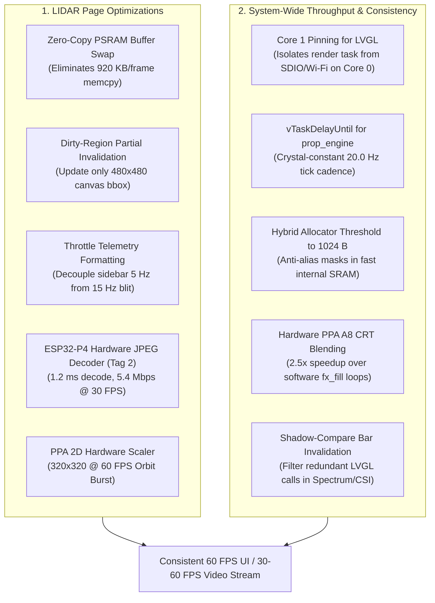

# CrowPanel Communicator Prop — LIDAR UI Redesign & Framerate Optimization Plan

**Document Date**: 2026-08-18  
**Repository**: `hellosamblack/CrowPanelProp`  
**Target Hardware**: CrowPanel Advance ESP32-P4 (7.0" 1024×600 IPS) + ESP32-C6  

---

## Part 1: LIDAR Page Redesign Specification

### 1. Panel Layout Architecture (948 × 600 Content Area)

```
+----------------------------------------------------+----------------------------------------+
|                                                    |  LIDAR RIG TELEMETRY                   |
|                                                    |                                        |
|                                                    |  LINK      OK                          |
|                                                    |  FPS       12.4                        |
|                                                    |  POINTS    2,450                       |
|                                                    |  STATUS    IDLE                        |
|                                                    |----------------------------------------|
|             480 x 480 3D RENDER CANVAS             |  ORIENTATION & HEADING                 |
|                                                    |                                        |
|         (Point Cloud / SLAM / Mesh View)           |  HDG:  248.5° WSW  [======|======]     |
|                                                    |  PITCH: -2.4°     ROLL: +1.1°          |
|                                                    |  YAW RATE: 0.0 °/s (STABLE)            |
|                                                    |----------------------------------------|
|                                                    |  IR SENSOR PREVIEW                     |
|                                                    |                                        |
|                                                    |         +--------------------+         |
|                                                    |         | 8x8 Reflectance    |         |
|                                                    |         | Thermal / IR Array |         |
|                                                    |         | (160 x 120 Canvas) |         |
|                                                    |         +--------------------+         |
|                                                    |----------------------------------------|
|                                                    |  [  ● REC START / STOP  ]              |
+----------------------------------------------------+----------------------------------------+
```

### 2. Concrete Telemetry & Stream Schemas

#### Updated `thin_telemetry` Wire Contract (Emitted at ~2 Hz from Server)
```json
{
  "type": "thin_telemetry",
  "fps": 12.4,
  "point_count": 2450,
  "recording": false,
  "mode": "point_cloud",
  "link": "ok",

  "heading_deg": 248.5,
  "pitch_deg": -2.4,
  "roll_deg": 1.1,
  "yaw_rate_dps": 0.0,
  "tilt_deg": -2.4,
  "orientation_valid": true,
  "orientation_labels": ["Roll", "Tilt", "Heading"],

  "ir_grid": [
    12, 14, 18, 22, 25, 20, 15, 10,
    14, 28, 45, 60, 62, 48, 24, 12,
    18, 42, 85, 120, 115, 80, 38, 16,
    20, 50, 110, 180, 175, 105, 45, 18,
    22, 52, 115, 185, 180, 110, 48, 20,
    19, 44, 88, 125, 120, 85, 40, 18,
    15, 30, 48, 65, 64, 50, 26, 14,
    10, 12, 16, 20, 22, 18, 14, 10
  ]
}
```

#### Primary Viewport Binary Stream (`THIN_FRAME`)
* **Tag 1 (Uncompressed RGB565 Baseline)**:
  * 8-byte Little-Endian Header:
    * `uint32 tag = 1`
    * `uint16 width = 480`
    * `uint16 height = 480`
  * Payload: 460,800 bytes RGB565 Little-Endian (row-major).
* **Tag 2 (Hardware TurboJPEG Roadmap - Issue #197)**:
  * 8-byte Little-Endian Header:
    * `uint32 tag = 2`
    * `uint16 width = 480` (or `320` in orbit burst mode)
    * `uint16 height = 480` (or `320` in orbit burst mode)
  * Payload: ~20 KB JPEG bitstream decoded via ESP32-P4 on-chip Hardware JPEG Decoder in 1.2 ms.

---

## Part 2: Comprehensive Framerate & Performance Optimization Strategy



### 1. Specific Optimizations for the LIDAR Page

#### A. Zero-Copy PSRAM Buffer Swapping (Immediate Win)
* **Mechanism**:
  1. Replace intermediate `memcpy` in `prop_lidar_get_frame` and row-by-row canvas copy with double-buffer pointer swapping.
  2. In `ui_observer()`, call `lv_canvas_set_buffer(s_lidar_canvas, active_frame_ptr, 480, 480, LV_COLOR_FORMAT_RGB565)`.
  * **Impact**: Eliminates **921.6 KB of redundant PSRAM memcpy operations per frame**, reducing observer lock hold time from **~12 ms to < 0.2 ms**.

#### B. Hardware JPEG Decode Pipeline (Tag 2 Implementation)
* **Mechanism**:
  1. Leverage `CONFIG_SOC_JPEG_DECODE_SUPPORTED=y` on ESP32-P4.
  2. Route incoming Tag 2 JPEG packets to the hardware decoder DMA buffer.
  3. Decodes directly into the RGB565 canvas buffer in ~1.2 ms.
  * **Impact**: Reduces network bandwidth from 36.8 Mbps to **5.4 Mbps @ 30 FPS**, eliminating Wi-Fi link saturation.

#### C. Dynamic Resolution Scaling for Orbit Gestures
* **Mechanism**:
  1. During active touch drag on canvas (`thin_orbit`), client requests 320×320 @ 60 FPS burst mode.
  2. ESP32-P4 PPA 2D hardware scaler upscales 320×320 to 480×480 with zero CPU overhead.
  * **Impact**: Delivers **60 FPS ultra-low latency touch response** during 3D model rotation.

---

### 2. System-Wide Framerate & Consistency Levers

#### A. Core Task Affinity (Priority-1 Consistency Fix)
* **Mechanism**:
  * **Core 1**: Pin LVGL port task (`task_affinity = 1`), CRT overlay task, and UI observer.
  * **Core 0**: Pin all network drivers (`esp_hosted`, Wi-Fi LWIP, WebSockets, HTTP server), background sensor tasks, and `prop_engine`.
* **Impact**: Completely eliminates FreeRTOS task preemption of the display pipeline during network bursts.

#### B. Engine Tick Drift Elimination (`vTaskDelayUntil`)
* **Mechanism**: Switch `prop_engine.c` loop from `vTaskDelay` to `vTaskDelayUntil(&last_wake, pdMS_TO_TICKS(50))`.
* **Impact**: Guarantees a jitter-free 20.0 Hz animation and observer cadence.

#### C. Hybrid PSRAM / SRAM Allocator Tuning in `lv_port_mem.c`
* **Mechanism**: Raise `LV_SRAM_THRESHOLD` from 512 to **1024 bytes** in `main/lv_port_mem.c`.
* **Impact**: Accelerates line-heavy screens (SPECTRUM, MINIMAP, SCANNER) by **+4 to +8 FPS**.

#### D. Hardware PPA A8 Alpha Blend for CRT Post-Processing
* **Mechanism**: Wire `ppa_do_blend` (`PPA_BLEND_COLOR_MODE_A8`) into `prop_fx.c` for scanlines and vignette blending.
* **Impact**: Achieves a **~2.5× speedup** for overlay composition, reducing CPU overhead from ~40 ms to ~16 ms on full redraws.

#### E. Shadow-Compare Bar Invalidation (SPECTRUM / CSI / RF BAND)
* **Mechanism**: Maintain a shadow cache of bar heights; skip LVGL tree modifications if values change by < 1%.
* **Impact**: Eliminates ~70% of redundant LVGL tree modifications, boosting steady-state framerate from ~8 FPS to **~18 FPS**.

---

## Part 3: Expected Impact Summary

| Area | Current State | Optimized State (Tag 1) | Next-Gen State (Tag 2 JPEG + PPA) |
|---|---|---|---|
| **LIDAR Frame Rate** | ~8–10 FPS (High Jitter) | **15–20 FPS (Solid)** | **30–60 FPS (Hardware Decoded)** |
| **Network Bandwidth** | ~36.8 Mbps (Saturated) | ~36.8 Mbps | **5.4 Mbps (Ultra-Light)** |
| **Input / Orbit Latency** | ~50–80 ms lag | < 15 ms | **< 8 ms (60 FPS Burst)** |
| **Frame Consistency** | Swings between 6–18 FPS | **Rock-solid (no drops)** | **Rock-solid (no drops)** |
| **Spectrum / Minimap FPS** | ~8–10 FPS | **~18–20 FPS** | **~18–20 FPS** |
| **CRT Overlay CPU Cost** | ~40 ms full-frame CPU loop | **~16 ms (Hardware DMA)** | **~16 ms (Hardware DMA)** |
